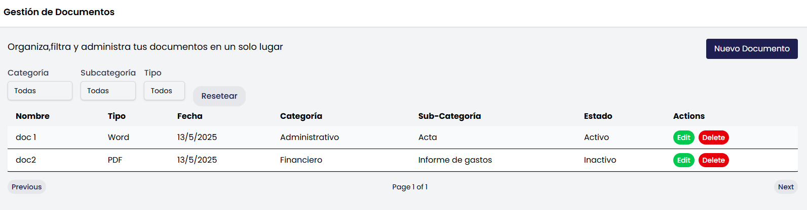
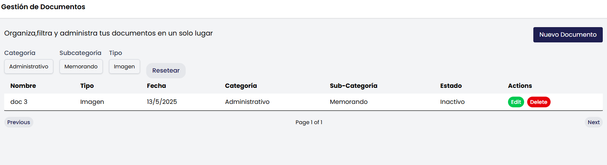

# PRUEBA-PGD

Aplicación de una sola página en React + TypeScript para la gestión documental, creada con Vite y estilizada con Tailwind CSS v4. Incluye operaciones CRUD, filtrado por categoría/subcategoría/tipo y persistencia en `localStorage`.

## Contenido

- [Características](#caracter%C3%ADsticas)  
- [Tecnologías](#tecnolog%C3%ADas)  
- [Estructura del proyecto](#estructura-del-proyecto)  
- [Cómo empezar](#c%C3%B3mo-empezar)  
  - [Requisitos](#requisitos)  
  - [Instalación](#instalaci%C3%B3n)  
  - [Desarrollo](#desarrollo)  
  - [Build de producción](#build-de-producci%C3%B3n)  
- [Scripts disponibles](#scripts-disponibles)  
- [Hecho por ](#hecho-por)  

## Características

- Arquitectura Atomic Design: átomos, moléculas, organismos, plantillas y páginas  
- Hooks personalizados (`useDocuments`, `useCategories`) para lógica de negocio  
- Operaciones CRUD sobre documentos con formularios en modal  
- Filtrado por categoría, subcategoría y tipo de documento  
- Paginación en la tabla de documentos  
- Persistencia local en `localStorage` mediante un servicio wrapper  
- Componentes accesibles con atributos ARIA  
- Tipado estricto con TypeScript (opción `strict` habilitada)  
- Estilos utilitarios con Tailwind CSS v4  

## Tecnologías

- Framework: React 18  
- Lenguaje: TypeScript  
- Bundler: Vite  
- Estilos: Tailwind CSS v4  
- Routing: React Router v6  

## Estructura del proyecto

PRUEBA-PGD/
├── public/
│ └── index.html
├── src/
│ ├── assets/
│ ├── components/
│ │ ├── atoms/
│ │ │ ├── Button.tsx
│ │ │ ├── Input.tsx
│ │ │ ├── Select.tsx
│ │ │ ├── Typography.tsx
│ │ │ ├── Modal.tsx
│ │ │ └── RadioGroup.tsx
│ │ ├── molecules/
│ │ │ ├── CategorySelect.tsx
│ │ │ ├── SubcategorySelect.tsx
│ │ │ └── FilterControls.tsx
│ │ ├── organisms/
│ │ │ ├── DocumentRow.tsx
│ │ │ ├── DocumentTable.tsx
│ │ │ ├── DocumentForm.tsx
│ │ │ └── ConfirmDialog.tsx
│ │ ├── templates/
│ │ │ └── MainLayout.tsx
│ │ └── pages/
│ │ └── DocumentsPage.tsx
│ ├── hooks/
│ │ ├── useDocuments.ts
│ │ └── useCategories.ts
│ ├── types/
│ │ ├── document.ts
│ │ └── category.ts
│ ├── services/
│ │ └── storageService.ts
│ ├── App.tsx
│ └── index.tsx
├── .eslintrc.js
├── .prettierrc
├── tsconfig.json
├── vite.config.ts
└── README.md

## Cómo empezar

### Requisitos

- Node.js 16 o superior  
- npm o Yarn  

### Instalación

bash
git clone https://github.com/tu-usuario/prueba-pgd.git
cd prueba-pgd
npm install / yarn install

### Desarrollo

bash
npm run dev /yarn dev

### Build de producción
npm run build / yarn build

npm run preview / yarn preview

## Scripts disponibles
dev: inicia el servidor de desarrollo con hot-reload

build: genera la versión de producción en dist/

preview: sirve la build de producción localmente

## Hecho por 
Sara Gabriela Garcia 

